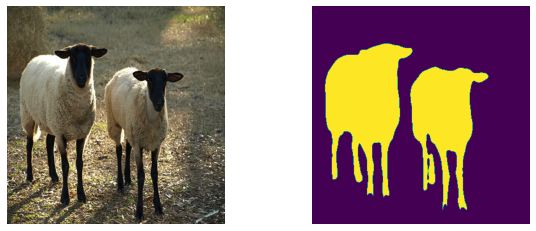

## Training U-Net with ResNet backbone on the COCO dataset

***
### Usage
```
unet_coco.py --unet_backbone=<ResNetXX>  --dataset=</path/to/coco> --output_dir=<./output/path> [flags]

flags:
  --unet_backbone: <ResNet18|ResNet50>: Type of ResNet to use as backbone
  --output_dir:   Directory to save model checkpoints and tensorboard log data

  --base_lr:      SGD optimizer base learning rate (default: '0.005')
  --momentum:     SGD optimizer momentum (default: '0.9')
  --batch_size:   Input batch size (default: '16')
  --dtype:<float16|float32>: Mixed precision or normal mode (default: 'float32')
  --epochs:       Number of epochs to train (default: '20')
  --image_size:   Image size in pixels (default: '256')
  --L2_reg:       L2 weight regularization (default: '0.0001')
  --loss_scale:   Loss scale for numerical stability when dtype=float16 (default: '1.0')
  --crop_min_size: The minimum size of the random image crops relative to the whole image (default: '0.8')
```

***
Only the following labels that are also present in the Pascal VOC dataset are used:
```
['person', 'bicycle', 'car', 'motorcycle', 'airplane', 'bus',
 'train', 'boat', 'bird', 'cat', 'dog', 'horse', 'sheep',
 'cow', 'bottle', 'chair', 'couch', 'potted plant', 'dining table', 'tv']
```
This list is also accessible via `elegy.nets.unet.COCO_CLASSNAMES` and the corresponding class indices as `elegy.nets.unet.COCO_CHANNELS`.


***
### Pretrained Models

| Model    | Mean IoU | Global Accuracy |  Weight Files |
| ---      | ---      | ---             | ---           |
| UNet_R18 | 0.572    | 0.904           | [model.pkl](https://github.com/poets-ai/elegy-assets/releases/download/unet_r18_coco_rev0/UNet_R18_COCO_weights_rev0.pkl) |
| UNet_R50 | 0.625    | 0.913           | [model.pkl](https://github.com/poets-ai/elegy-assets/releases/download/unet_r50_coco_rev0/UNet_R50_COCO_weights_rev0.pkl) |


The pretrained models were trained with the following parameters:
`--image_size=384 --batch_size=16 --base_lr=0.005 --crop_min_size=0.8 --dtype=float16 --loss_scale=1024.`


Automatic download: `elegy.nets.unet.UNet_R18(weights='coco')`


***
### Example Inference

```
fname,_  = urllib.request.urlretrieve('https://upload.wikimedia.org/wikipedia/commons/thumb/3/3d/Take_ours%21.jpg/800px-Take_ours%21.jpg')
x        = np.array(PIL.Image.open(fname).resize([384,384])) / np.float32(255)
unet_r18 = elegy.nets.unet.UNet_R18(weights='coco')
y        = elegy.Model(unet_r18).predict(x[np.newaxis])[0]
i        = elegy.nets.unet.COCO_CLASSNAMES_TO_CHANNELS['sheep']

figure(0, (10,4))
subplot(121); imshow(x);               axis('off');
subplot(122); imshow(y.argmax(-1)==i); axis('off');
```



***
[1] Ronneberger, Olaf, Philipp Fischer, and Thomas Brox. "U-net: Convolutional networks for biomedical image segmentation." International Conference on Medical image computing and computer-assisted intervention. Springer, Cham, 2015.

[2] Lin, Tsung-Yi, et al. "Microsoft coco: Common objects in context." European conference on computer vision. Springer, Cham, 2014.


